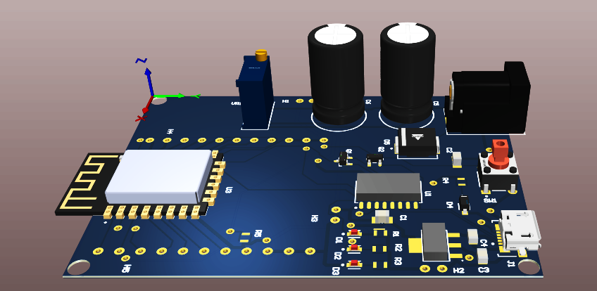
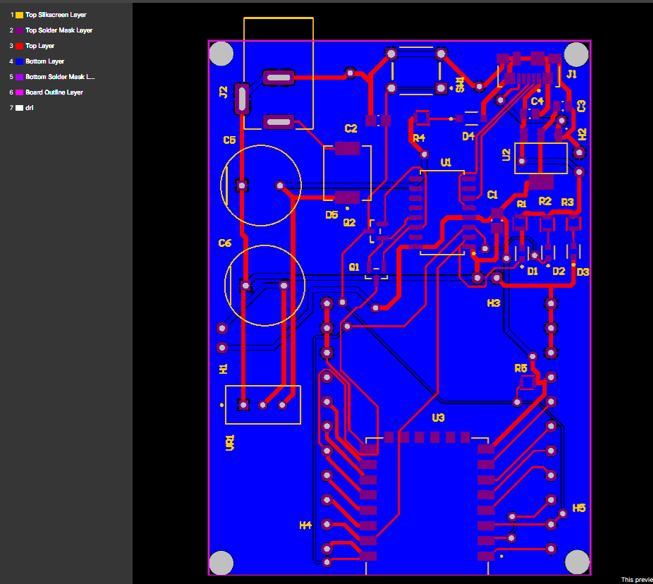
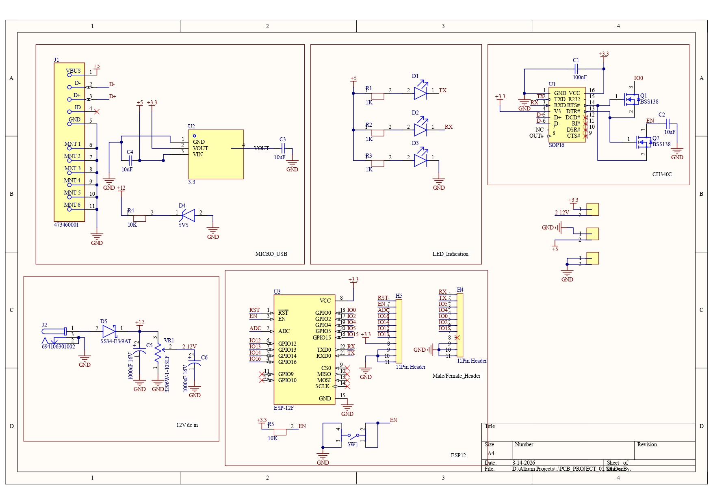
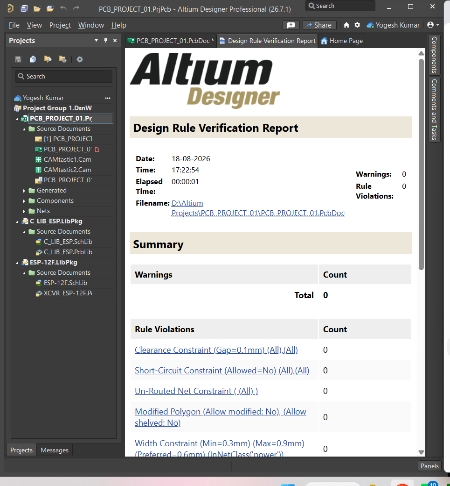

# ESP-12F Custom Development Board

A custom 2-layer ESP-12F development board designed using Altium Designer.

## Project Overview

This project is a custom ESP-12F development board with a CH340C USB-to-UART interface for USB connectivity, programming, and serial communication.

The board includes:

- ESP-12F Wi-Fi module
- CH340C USB-to-UART interface
- Micro-USB interface
- 3.3V regulated power supply
- Reset and Enable circuitry
- GPIO expansion headers
- TX/RX LED indication
- External DC power input
- GND copper plane
- ESP-12F antenna keep-out area

## Design Workflow

Schematic Design  
→ Component Placement  
→ PCB Layout  
→ Routing  
→ Antenna Keep-Out  
→ DRC Verification  
→ Gerber Generation  
→ NC Drill Generation

## Tools Used

- Altium Designer

## PCB Verification

Final DRC:

- Warnings: 0
- Rule Violations: 0
- Clearance Violations: 0
- Short-Circuit Violations: 0
- Un-Routed Nets: 0

## Project Files

- `Altium_Project/` — Schematic and PCB source files
- `Gerber/` — Manufacturing Gerber and drill files
- `Images/` — PCB design images
- `DRC/` — Design Rule Check report

## PCB Preview

## Author

Yogesh Kumar
